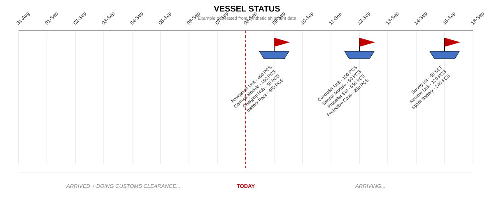
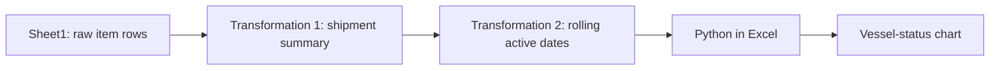

# Logistics Vessel Tracker

An operational analytics project that transforms item-level shipment records into a dynamic vessel-arrival dashboard using **Python in Excel**, **pandas**, **Matplotlib**, and Excel dynamic-array formulas.

> This portfolio project is based on a real logistics workflow. Every record is synthetic. No employer, customer, invoice, bill-of-lading, product, or shipment data is included.



## Business problem

One shipment may occupy several raw-data rows because it contains different commodities and quantities. The project answers:

- Which vessels are arriving soon?
- What commodities are included in each shipment?
- Which shipments remain active because delivery is incomplete?
- Which arrivals require attention today?

## End-to-end workflow



The demonstration uses one consistent synthetic dataset throughout:

1. [Raw shipment records](data/sample_shipments.csv)
2. [Transformation 1 — shipment-level summary](data/stage1_shipment_summary.csv)
3. [Transformation 2 — 17-day rolling timeline](data/stage2_rolling_timeline.csv)
4. [Excel formulas with illustrated tables](docs/excel_formulas.md)
5. [Python in Excel visualization](src/vessel_status.py)

For reproducibility, the files and chart treat **08-Sep-2026 as the example TODAY**. The operational workbook uses `TODAY()` dynamically.

## Transformation summary

| Stage | Input grain | Main operations | Output grain |
|---|---|---|---|
| Raw `Sheet1` | One commodity line | Source records | Repeated shipment keys |
| Transformation 1 | Repeated shipment keys | `UNIQUE`, `XLOOKUP`, `HSTACK`, `FILTER`, `TEXTJOIN` | One row per shipment |
| Transformation 2 | Shipment rows | Arrival-date match and active-delivery rules | One row per calendar date |
| Visualization | Rolling date table | pandas cleaning and Matplotlib drawing | Operational timeline |

## Repository structure

```text
.
├── assets/
│   └── vessel_status_demo.svg
├── data/
│   ├── sample_shipments.csv
│   ├── stage1_shipment_summary.csv
│   └── stage2_rolling_timeline.csv
├── docs/
│   └── excel_formulas.md
├── src/
│   └── vessel_status.py
├── .gitignore
├── requirements.txt
└── README.md
```

## Run in Python in Excel

1. Reproduce the transformed table in `G1:I32` with `Date`, `Commodity`, and `Qty`.
2. Insert a Python cell.
3. Copy the code from `src/vessel_status.py`.
4. Keep `fig` as the final expression so Excel displays the chart.

Change `SOURCE_RANGE` if the table is stored elsewhere.

## Skills demonstrated

- Translating logistics operations into data-transformation rules
- Cleaning and validating operational data
- Aggregating item-level records into shipment-level entities
- Combining Excel dynamic arrays with Python
- Building a time-based operational visualization
- Applying international trade and logistics domain knowledge
- Protecting confidential information through synthetic data

## Future improvements

- Replace full-column formulas with structured Excel Table references.
- Add validation for duplicated or inconsistent shipment keys.
- Add explicit statuses for in transit, customs clearance, delivered, and delayed.
- Separate extraction, transformation, and visualization for unit testing.
- Develop an interactive dashboard version.

## Author

**Khaothip** — International Trade and Business Logistics background, developing data and analytics skills for graduate study in Data Science.
